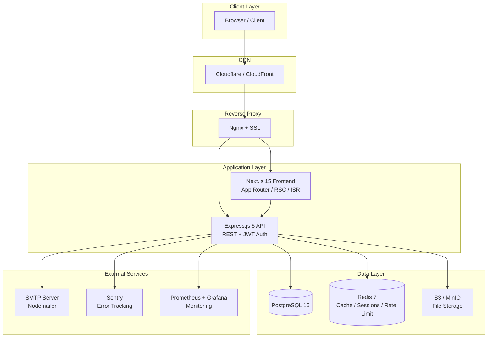
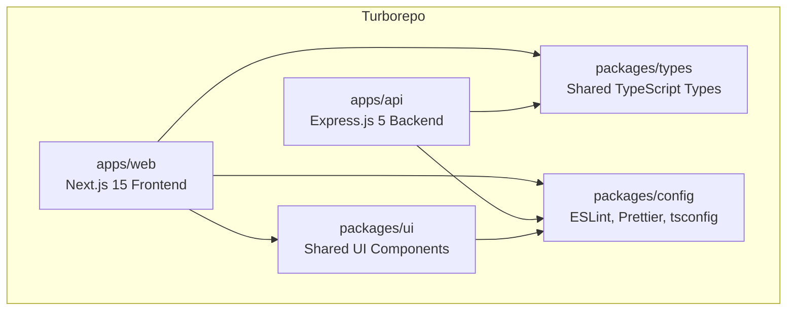
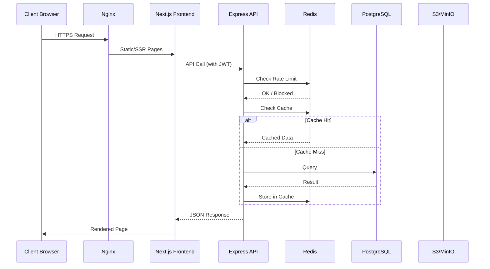
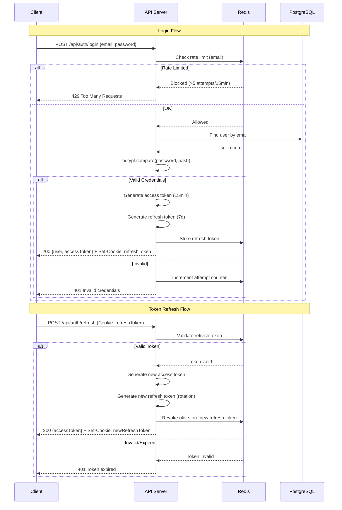
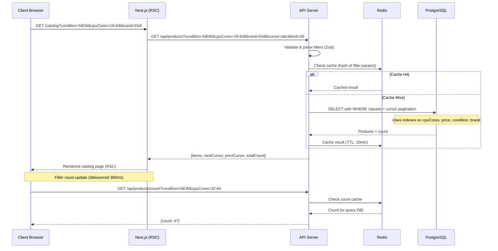
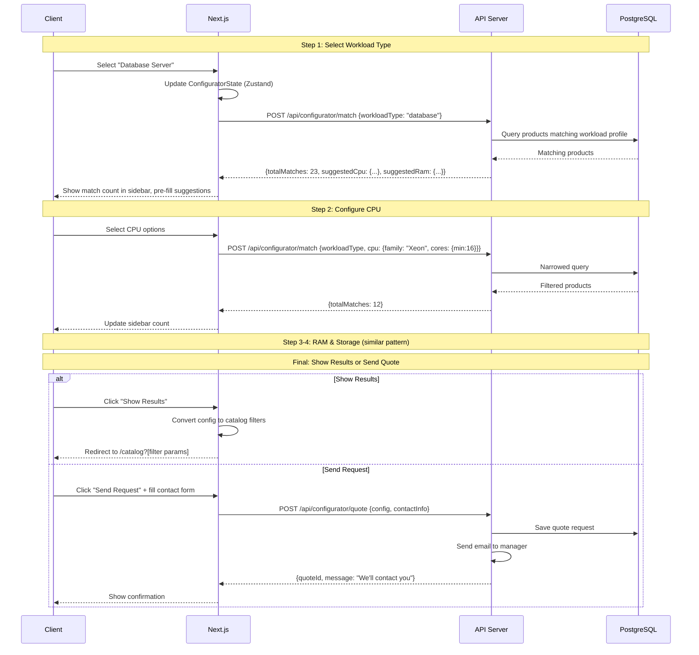
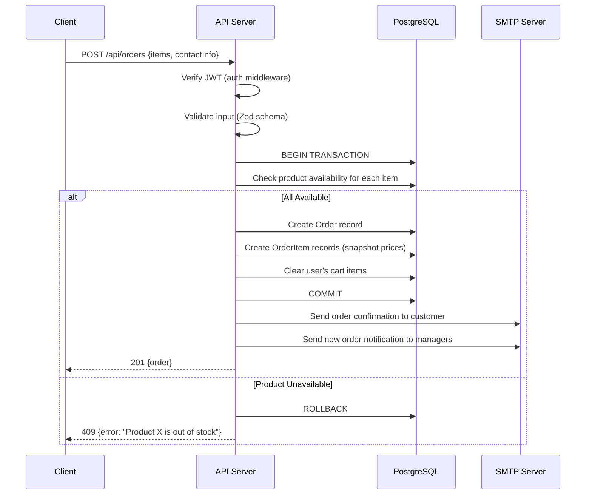

# Design Document: Server Sales Portal

## Overview

The Server Sales Portal is a full-stack B2B/B2C web application for selling new and used physical servers. It provides a modern, dark-first UI inspired by Linear.app and Vercel Dashboard, featuring a server catalog with advanced filtering, a 4-step server configurator wizard, a ticket-based support system, and a comprehensive admin panel.

The system is built as a Turborepo monorepo with a Next.js 15 frontend (App Router, RSC) and an Express.js 5 backend, backed by PostgreSQL 16 and Redis 7. Authentication uses JWT with access/refresh token rotation. The architecture prioritizes performance through ISR, Redis caching, cursor-based pagination, and CDN delivery for static assets.

The portal targets two user segments: end customers (B2C) who browse and order servers, and business clients (B2B) who use the configurator for custom quotes. Admin users manage products, orders, tickets, and users through a dedicated admin interface with role-based access control (CLIENT/MANAGER/ADMIN).

## Architecture

### System Architecture



### Monorepo Structure



### Request Flow



## Components and Interfaces

### Component 1: Catalog Service

**Purpose**: Manages product listing, filtering, searching, and pagination for the server catalog.

**Interface**:
```typescript
interface ICatalogService {
  getProducts(filters: ProductFilters, pagination: CursorPagination): Promise<PaginatedResult<Product>>
  getProductBySlug(slug: string): Promise<Product | null>
  searchProducts(query: string, limit: number): Promise<Product[]>
  getFilterOptions(): Promise<FilterOptions>
  getBrands(): Promise<Brand[]>
  invalidateCache(productId?: string): Promise<void>
}

interface ProductFilters {
  condition?: Condition[]
  cpuFamily?: string[]
  cpuCores?: { min?: number; max?: number }
  cpuCount?: number[]
  cpuFrequency?: { min?: number; max?: number }
  cpuSocket?: string[]
  ramGb?: { min?: number; max?: number }
  ramType?: string[]
  ramFrequency?: { min?: number; max?: number }
  ramSlots?: number[]
  storageType?: string[]
  storageSize?: { min?: number; max?: number }
  hotSwap?: boolean
  formFactor?: string[]
  units?: number[]
  psuWattage?: { min?: number; max?: number }
  priceRange?: { min?: number; max?: number }
  brand?: string[]
  stockStatus?: StockStatus[]
  sort?: SortOption
}

interface CursorPagination {
  cursor?: string
  limit: number
  direction: 'forward' | 'backward'
}

interface PaginatedResult<T> {
  items: T[]
  nextCursor: string | null
  prevCursor: string | null
  totalCount: number
}
```

**Responsibilities**:
- Parse and validate filter parameters from URL query strings
- Build optimized Prisma queries with proper indexing
- Manage Redis cache for product listings (10min TTL) and filter options (1hr TTL)
- Support cursor-based pagination for efficient large dataset traversal
- Provide debounced count updates for filter UI (300ms)

### Component 2: Configurator Service

**Purpose**: Implements the 4-step server configurator wizard logic, matching products to configurations and generating quotes.

**Interface**:
```typescript
interface IConfiguratorService {
  getWorkloadTypes(): Promise<WorkloadType[]>
  matchProducts(config: ConfiguratorState): Promise<MatchResult>
  generateQuote(config: ConfiguratorState, contactInfo: ContactInfo): Promise<Quote>
}

interface ConfiguratorState {
  step: 1 | 2 | 3 | 4
  workloadType?: WorkloadType
  cpu?: CpuConfig
  ram?: RamConfig
  storage?: StorageConfig
}

interface CpuConfig {
  family: string
  cores: { min: number; max: number }
  count: number
  frequency: { min: number; max: number }
  socket?: string
}

interface RamConfig {
  sizeGb: { min: number; max: number }
  type: string
  frequency?: { min: number; max: number }
  slots?: number
}

interface StorageConfig {
  type: string
  sizeGb: { min: number; max: number }
  hotSwap: boolean
  count?: number
}

interface MatchResult {
  products: Product[]
  totalMatches: number
  filters: ProductFilters
}
```

**Responsibilities**:
- Map workload types to recommended hardware configurations
- Progressively narrow product matches as user advances through steps
- Maintain live match count for sidebar display
- Generate quote requests with full configuration details
- Convert configurator state to catalog filter parameters

### Component 3: Auth Service

**Purpose**: Handles user authentication, token management, and session lifecycle.

**Interface**:
```typescript
interface IAuthService {
  register(data: RegisterInput): Promise<AuthResult>
  login(credentials: LoginInput): Promise<AuthResult>
  refreshToken(refreshToken: string): Promise<TokenPair>
  logout(userId: string, refreshToken: string): Promise<void>
  getCurrentUser(accessToken: string): Promise<User | null>
  verifyAccessToken(token: string): Promise<TokenPayload | null>
}

interface RegisterInput {
  email: string
  password: string
  name: string
  company?: string
  phone?: string
}

interface LoginInput {
  email: string
  password: string
}

interface AuthResult {
  user: SafeUser
  tokens: TokenPair
}

interface TokenPair {
  accessToken: string
  refreshToken: string
  expiresIn: number
}

interface TokenPayload {
  userId: string
  email: string
  role: Role
  iat: number
  exp: number
}
```

**Responsibilities**:
- Hash passwords with bcrypt (12 rounds)
- Issue JWT access tokens (15min expiry) and refresh tokens (7d, httpOnly cookie)
- Enforce rate limiting on login attempts (5 per 15min via Redis)
- Manage refresh token rotation and revocation
- Provide RBAC middleware for route protection

### Component 4: Order Service

**Purpose**: Manages the order lifecycle from cart to fulfillment status tracking.

**Interface**:
```typescript
interface IOrderService {
  createOrder(userId: string, input: CreateOrderInput): Promise<Order>
  getOrderById(orderId: string, userId: string): Promise<Order | null>
  getUserOrders(userId: string, pagination: CursorPagination): Promise<PaginatedResult<Order>>
  updateOrderStatus(orderId: string, status: OrderStatus, managerId: string): Promise<Order>
  getAdminOrders(filters: OrderFilters, pagination: CursorPagination): Promise<PaginatedResult<Order>>
}

interface CreateOrderInput {
  items: Array<{ productId: string; quantity: number }>
  contactName: string
  contactEmail: string
  contactPhone: string
  company?: string
  notes?: string
  deliveryAddress?: string
}

type OrderStatus = 'PENDING' | 'CONFIRMED' | 'PROCESSING' | 'SHIPPED' | 'DELIVERED' | 'CANCELLED'
```

**Responsibilities**:
- Validate product availability and stock status before order creation
- Assign sequential order numbers
- Trigger email notifications on status changes
- Enforce order status workflow transitions
- Support admin filtering and bulk operations

### Component 5: Ticket Service

**Purpose**: Manages the support ticket system with real-time chat-like messaging.

**Interface**:
```typescript
interface ITicketService {
  createTicket(userId: string, input: CreateTicketInput): Promise<Ticket>
  getTicketById(ticketId: string, userId: string): Promise<TicketWithMessages | null>
  getUserTickets(userId: string, pagination: CursorPagination): Promise<PaginatedResult<Ticket>>
  addMessage(ticketId: string, userId: string, content: string, attachments?: string[]): Promise<TicketMessage>
  updateTicketStatus(ticketId: string, status: TicketStatus, managerId: string): Promise<Ticket>
  assignTicket(ticketId: string, managerId: string): Promise<Ticket>
  getAdminTickets(filters: TicketFilters, pagination: CursorPagination): Promise<PaginatedResult<Ticket>>
}

interface CreateTicketInput {
  subject: string
  message: string
  priority: TicketPriority
  orderId?: string
  attachments?: string[]
}

type TicketPriority = 'LOW' | 'MEDIUM' | 'HIGH' | 'URGENT'
type TicketStatus = 'OPEN' | 'IN_PROGRESS' | 'WAITING_CUSTOMER' | 'RESOLVED' | 'CLOSED'
```

**Responsibilities**:
- Create tickets with initial message
- Support threaded messaging with file attachments
- Manage ticket assignment to managers
- Enforce status workflow transitions
- Send email notifications on new messages and status changes

## Data Models

### Product Model

```typescript
interface Product {
  id: string
  slug: string
  name: string
  description: string
  shortDescription: string
  condition: Condition
  stockStatus: StockStatus
  price: number
  originalPrice?: number
  brand: string
  model: string

  // CPU Specifications
  cpuFamily: string
  cpuModel: string
  cpuCores: number
  cpuThreads: number
  cpuCount: number
  cpuFrequency: number      // GHz
  cpuBoostFrequency?: number // GHz
  cpuSocket: string

  // RAM Specifications
  ramGb: number
  ramType: string            // DDR4, DDR5
  ramFrequency: number       // MHz
  ramSlots: number
  ramSlotsUsed: number

  // Storage Specifications
  storageType: string        // SSD, HDD, NVMe
  storageSizeGb: number
  storageCount: number
  hotSwap: boolean

  // Physical Specifications
  formFactor: string         // 1U, 2U, 4U, Tower
  units: number
  psuWattage: number
  psuRedundant: boolean

  // Metadata
  customFields: Record<string, unknown>  // JSONB
  images: ProductImage[]
  seoTitle?: string
  seoDescription?: string
  featured: boolean
  viewCount: number

  createdAt: Date
  updatedAt: Date
}

type Condition = 'NEW' | 'REFURBISHED' | 'USED'
type StockStatus = 'IN_STOCK' | 'LOW_STOCK' | 'OUT_OF_STOCK' | 'PRE_ORDER'
```

**Validation Rules**:
- `slug` must be unique, URL-safe, auto-generated from name
- `price` must be positive number with max 2 decimal places
- `cpuCores` must be positive integer (1-128)
- `cpuCount` must be 1-8
- `ramGb` must be power of 2 (8, 16, 32, 64, 128, 256, 512, 1024, 2048)
- `storageSizeGb` must be positive integer
- `units` must be 1-48
- `psuWattage` must be positive integer (100-3000)
- At least one image required for published products

### Order Model

```typescript
interface Order {
  id: string
  orderNumber: string        // Sequential: ORD-000001
  userId: string
  status: OrderStatus
  items: OrderItem[]
  totalAmount: number

  // Contact Info
  contactName: string
  contactEmail: string
  contactPhone: string
  company?: string
  notes?: string
  deliveryAddress?: string

  // Tracking
  assignedManagerId?: string
  statusHistory: StatusChange[]

  createdAt: Date
  updatedAt: Date
}

interface OrderItem {
  id: string
  orderId: string
  productId: string
  productName: string        // Snapshot at order time
  productSlug: string
  quantity: number
  unitPrice: number          // Snapshot at order time
  totalPrice: number
}

interface StatusChange {
  from: OrderStatus
  to: OrderStatus
  changedBy: string
  changedAt: Date
  note?: string
}
```

**Validation Rules**:
- `orderNumber` auto-generated, sequential, unique
- `items` must contain at least one item
- `quantity` must be positive integer
- `totalAmount` must equal sum of item totalPrices
- `contactEmail` must be valid email format
- `contactPhone` must be valid phone format
- Status transitions must follow defined workflow

### User Model

```typescript
interface User {
  id: string
  email: string
  passwordHash: string
  name: string
  company?: string
  phone?: string
  role: Role
  isActive: boolean
  lastLoginAt?: Date
  createdAt: Date
  updatedAt: Date
}

type Role = 'CLIENT' | 'MANAGER' | 'ADMIN'

// Safe user (no password hash) for API responses
type SafeUser = Omit<User, 'passwordHash'>
```

**Validation Rules**:
- `email` must be unique, valid email format, max 255 chars
- `password` min 8 chars, must contain uppercase, lowercase, number
- `name` min 2 chars, max 100 chars
- `phone` optional, valid international format
- `role` defaults to CLIENT on registration

### Ticket Model

```typescript
interface Ticket {
  id: string
  ticketNumber: string       // Sequential: TKT-000001
  userId: string
  subject: string
  priority: TicketPriority
  status: TicketStatus
  assignedManagerId?: string
  orderId?: string           // Optional link to order
  messages: TicketMessage[]
  createdAt: Date
  updatedAt: Date
  resolvedAt?: Date
}

interface TicketMessage {
  id: string
  ticketId: string
  userId: string
  content: string
  attachments: string[]      // S3 URLs
  isInternal: boolean        // Manager-only notes
  createdAt: Date
}
```

**Validation Rules**:
- `subject` min 5 chars, max 200 chars
- `content` min 1 char, max 5000 chars, sanitized with DOMPurify
- `attachments` max 5 per message, each max 10MB, images only
- Status transitions must follow defined workflow
- Only MANAGER/ADMIN can set `isInternal: true`

## Sequence Diagrams

### Authentication Flow



### Product Catalog with Filtering



### Server Configurator Flow



### Order Creation Flow



## Key Functions with Formal Specifications

### Function 1: buildProductQuery()

```typescript
function buildProductQuery(
  filters: ProductFilters,
  pagination: CursorPagination
): PrismaQueryObject
```

**Preconditions:**
- `filters` is a valid `ProductFilters` object (validated by Zod)
- `pagination.limit` is a positive integer between 1 and 100
- `pagination.cursor` if provided, is a valid base64-encoded cursor string
- All range filters have `min <= max` when both are provided

**Postconditions:**
- Returns a valid Prisma `findMany` query object
- Query includes proper WHERE clauses for all non-empty filter fields
- Cursor-based pagination is correctly applied (using `id` as cursor field)
- Sort order is applied consistently with cursor direction
- No SQL injection possible (Prisma parameterized queries)

**Loop Invariants:**
- For filter construction loop: each processed filter produces a valid Prisma `where` clause
- Combined filters use AND logic (all conditions must match)

### Function 2: authenticateUser()

```typescript
async function authenticateUser(
  email: string,
  password: string
): Promise<AuthResult>
```

**Preconditions:**
- `email` is a non-empty string in valid email format
- `password` is a non-empty string (min 1 char)
- Redis connection is available for rate limiting
- Database connection is available

**Postconditions:**
- If rate limited: throws `RateLimitError` with retry-after time
- If user not found: throws `AuthenticationError("Invalid credentials")`
- If password mismatch: increments rate limit counter, throws `AuthenticationError("Invalid credentials")`
- If successful: returns `AuthResult` with valid `SafeUser` and `TokenPair`
- Access token expires in 15 minutes
- Refresh token expires in 7 days and is stored in Redis
- Error messages never reveal whether email exists (timing-safe)

**Loop Invariants:** N/A

### Function 3: matchConfiguratorProducts()

```typescript
async function matchConfiguratorProducts(
  config: ConfiguratorState
): Promise<MatchResult>
```

**Preconditions:**
- `config.step` is between 1 and 4
- If `config.step >= 2`: `config.workloadType` is defined
- If `config.step >= 3`: `config.cpu` is defined with valid ranges
- If `config.step >= 4`: `config.ram` is defined with valid ranges
- All numeric ranges have `min <= max`

**Postconditions:**
- Returns products matching ALL specified configuration criteria
- `totalMatches` equals the actual count of matching products in database
- `filters` contains the equivalent `ProductFilters` for catalog redirect
- Results are sorted by relevance (best match to workload type first)
- Empty config (step 1 only) returns all products

**Loop Invariants:**
- As step increases, `totalMatches` is monotonically non-increasing (more filters = fewer or equal matches)

### Function 4: createOrder()

```typescript
async function createOrder(
  userId: string,
  input: CreateOrderInput
): Promise<Order>
```

**Preconditions:**
- `userId` corresponds to an active user in the database
- `input.items` is non-empty array with valid product IDs
- `input.items[i].quantity` is positive integer for all items
- All referenced products exist and have `stockStatus !== 'OUT_OF_STOCK'`
- `input.contactEmail` is valid email format
- `input.contactPhone` is valid phone format

**Postconditions:**
- Order is created atomically (transaction)
- `order.orderNumber` is unique and sequential
- `order.totalAmount` equals sum of (unitPrice × quantity) for all items
- Each `OrderItem.unitPrice` is a snapshot of product price at creation time
- User's cart is cleared after successful order creation
- Confirmation email is sent to customer
- Notification email is sent to all managers
- If any product is unavailable: transaction is rolled back, no order created

**Loop Invariants:**
- For item processing: running total equals sum of all processed items' (unitPrice × quantity)
- All processed items have valid price snapshots from current product data

### Function 5: processFileUpload()

```typescript
async function processFileUpload(
  file: MulterFile,
  userId: string,
  context: 'product' | 'ticket'
): Promise<UploadResult>
```

**Preconditions:**
- `file` is non-null with valid buffer data
- `file.mimetype` starts with 'image/' (MIME type validation)
- `file.size` <= 10MB (10,485,760 bytes)
- `userId` corresponds to an active user
- User has permission to upload in given context (MANAGER/ADMIN for products, any authenticated for tickets)

**Postconditions:**
- File is stored in S3/MinIO with unique key: `{context}/{userId}/{uuid}.{ext}`
- Returns `UploadResult` with public URL and metadata
- Original filename is sanitized and stored as metadata
- Image is validated (can be decoded as valid image)
- No executable content is stored (double MIME check: header + magic bytes)

**Loop Invariants:** N/A

## Algorithmic Pseudocode

### Catalog Filter Query Builder

```typescript
// Algorithm: Build optimized Prisma query from filter parameters
function buildProductQuery(filters: ProductFilters, pagination: CursorPagination): PrismaQueryObject {
  // ASSERT: filters validated by Zod schema
  // ASSERT: pagination.limit in [1, 100]

  const where: PrismaWhere = {}

  // Step 1: Build WHERE clauses from filters
  if (filters.condition?.length) {
    where.condition = { in: filters.condition }
  }

  if (filters.brand?.length) {
    where.brand = { in: filters.brand }
  }

  // Range filters use gte/lte
  if (filters.cpuCores) {
    where.cpuCores = {}
    if (filters.cpuCores.min !== undefined) where.cpuCores.gte = filters.cpuCores.min
    if (filters.cpuCores.max !== undefined) where.cpuCores.lte = filters.cpuCores.max
  }

  if (filters.ramGb) {
    where.ramGb = {}
    if (filters.ramGb.min !== undefined) where.ramGb.gte = filters.ramGb.min
    if (filters.ramGb.max !== undefined) where.ramGb.lte = filters.ramGb.max
  }

  if (filters.priceRange) {
    where.price = {}
    if (filters.priceRange.min !== undefined) where.price.gte = filters.priceRange.min
    if (filters.priceRange.max !== undefined) where.price.lte = filters.priceRange.max
  }

  // Multi-value enum filters
  if (filters.cpuFamily?.length) where.cpuFamily = { in: filters.cpuFamily }
  if (filters.cpuSocket?.length) where.cpuSocket = { in: filters.cpuSocket }
  if (filters.ramType?.length) where.ramType = { in: filters.ramType }
  if (filters.storageType?.length) where.storageType = { in: filters.storageType }
  if (filters.formFactor?.length) where.formFactor = { in: filters.formFactor }
  if (filters.stockStatus?.length) where.stockStatus = { in: filters.stockStatus }

  // Boolean filters
  if (filters.hotSwap !== undefined) where.hotSwap = filters.hotSwap

  // Step 2: Build cursor pagination
  const orderBy = resolveSort(filters.sort)  // default: { createdAt: 'desc' }
  const cursorClause = pagination.cursor
    ? { id: decodeCursor(pagination.cursor) }
    : undefined

  // Step 3: Assemble final query
  // ASSERT: where contains only valid Prisma filter operators
  return {
    where,
    orderBy,
    take: pagination.limit + 1,  // fetch one extra to determine hasNext
    cursor: cursorClause,
    skip: cursorClause ? 1 : 0,  // skip the cursor item itself
    include: { images: { take: 1, orderBy: { order: 'asc' } } }
  }
}

// POSTCONDITION: returned query is valid Prisma findMany input
// POSTCONDITION: take = limit + 1 allows detecting next page existence
```

### Authentication Algorithm

```typescript
// Algorithm: Authenticate user with rate limiting and token generation
async function authenticateUser(email: string, password: string): Promise<AuthResult> {
  // ASSERT: email is valid format, password is non-empty

  // Step 1: Check rate limit
  const rateLimitKey = `auth:attempts:${email}`
  const attempts = await redis.get(rateLimitKey)

  if (attempts && parseInt(attempts) >= 5) {
    const ttl = await redis.ttl(rateLimitKey)
    throw new RateLimitError(`Too many attempts. Retry after ${ttl} seconds`)
  }

  // Step 2: Find user (constant-time regardless of existence)
  const user = await prisma.user.findUnique({ where: { email } })

  // Step 3: Verify password (always run bcrypt.compare to prevent timing attacks)
  const dummyHash = '$2b$12$dummy.hash.for.timing.safety.purposes'
  const hashToCompare = user?.passwordHash ?? dummyHash
  const isValid = await bcrypt.compare(password, hashToCompare)

  if (!user || !isValid) {
    // Increment rate limit counter
    await redis.multi()
      .incr(rateLimitKey)
      .expire(rateLimitKey, 900)  // 15 minutes
      .exec()

    throw new AuthenticationError('Invalid credentials')
  }

  // Step 4: Check account status
  if (!user.isActive) {
    throw new AuthenticationError('Account is deactivated')
  }

  // Step 5: Generate tokens
  const accessToken = jwt.sign(
    { userId: user.id, email: user.email, role: user.role },
    ACCESS_TOKEN_SECRET,
    { expiresIn: '15m' }
  )

  const refreshToken = crypto.randomUUID()
  await redis.setex(`refresh:${refreshToken}`, 7 * 24 * 3600, user.id)

  // Step 6: Update last login
  await prisma.user.update({
    where: { id: user.id },
    data: { lastLoginAt: new Date() }
  })

  // Clear rate limit on success
  await redis.del(rateLimitKey)

  // POSTCONDITION: tokens are valid, refresh token stored in Redis
  return {
    user: excludeFields(user, ['passwordHash']),
    tokens: { accessToken, refreshToken, expiresIn: 900 }
  }
}
```

### Configurator Matching Algorithm

```typescript
// Algorithm: Match products to configurator state with progressive narrowing
async function matchConfiguratorProducts(config: ConfiguratorState): Promise<MatchResult> {
  // ASSERT: config.step in [1, 4]
  // ASSERT: each step's data is defined for steps <= config.step

  // Step 1: Get workload profile (recommended specs for workload type)
  const profile = WORKLOAD_PROFILES[config.workloadType ?? 'general']
  // profile contains: { minCores, minRam, storageType, ... }

  const filters: ProductFilters = {}

  // Step 2: Apply workload-based defaults
  if (config.workloadType) {
    filters.cpuCores = { min: profile.minCores }
    filters.ramGb = { min: profile.minRamGb }
    if (profile.storageType) filters.storageType = [profile.storageType]
  }

  // Step 3: Override with user selections (more specific)
  if (config.cpu) {
    if (config.cpu.family) filters.cpuFamily = [config.cpu.family]
    if (config.cpu.cores) filters.cpuCores = config.cpu.cores
    if (config.cpu.count) filters.cpuCount = [config.cpu.count]
    if (config.cpu.frequency) filters.cpuFrequency = config.cpu.frequency
    if (config.cpu.socket) filters.cpuSocket = [config.cpu.socket]
  }

  if (config.ram) {
    if (config.ram.sizeGb) filters.ramGb = config.ram.sizeGb
    if (config.ram.type) filters.ramType = [config.ram.type]
    if (config.ram.frequency) filters.ramFrequency = config.ram.frequency
  }

  if (config.storage) {
    if (config.storage.type) filters.storageType = [config.storage.type]
    if (config.storage.sizeGb) filters.storageSize = config.storage.sizeGb
    if (config.storage.hotSwap !== undefined) filters.hotSwap = config.storage.hotSwap
  }

  // Step 4: Query products with assembled filters
  // INVARIANT: filters only become more restrictive as step increases
  const query = buildProductQuery(filters, { limit: 20, direction: 'forward' })
  const [products, totalCount] = await Promise.all([
    prisma.product.findMany(query),
    prisma.product.count({ where: query.where })
  ])

  // POSTCONDITION: totalMatches <= previous step's totalMatches
  return {
    products: products.slice(0, 20),
    totalMatches: totalCount,
    filters  // for "Show Results" → catalog redirect
  }
}

// Workload profiles define recommended minimum specs
const WORKLOAD_PROFILES: Record<string, WorkloadProfile> = {
  database: { minCores: 16, minRamGb: 64, storageType: 'NVMe', minStorageGb: 500 },
  virtualization: { minCores: 32, minRamGb: 128, storageType: 'SSD', minStorageGb: 1000 },
  web_hosting: { minCores: 8, minRamGb: 32, storageType: 'SSD', minStorageGb: 250 },
  ai_ml: { minCores: 32, minRamGb: 256, storageType: 'NVMe', minStorageGb: 2000 },
  file_storage: { minCores: 4, minRamGb: 16, storageType: 'HDD', minStorageGb: 4000 },
  general: { minCores: 4, minRamGb: 16, storageType: undefined, minStorageGb: 100 }
}
```

### Cache Invalidation Algorithm

```typescript
// Algorithm: Invalidate Redis cache with targeted or bulk strategies
async function invalidateProductCache(productId?: string): Promise<void> {
  // ASSERT: Redis connection is available

  if (productId) {
    // Targeted invalidation: remove specific product and related list caches
    const product = await prisma.product.findUnique({ where: { id: productId } })
    if (!product) return

    await redis.del(`product:${product.slug}`)
    // Invalidate all list caches (they may contain this product)
    const listKeys = await redis.keys('products:list:*')
    if (listKeys.length > 0) {
      await redis.del(...listKeys)
    }
  } else {
    // Bulk invalidation: clear all product-related caches
    const patterns = ['products:list:*', 'product:*', 'products:count:*']
    for (const pattern of patterns) {
      const keys = await redis.keys(pattern)
      if (keys.length > 0) {
        await redis.del(...keys)
      }
    }
  }

  // POSTCONDITION: relevant cache entries are removed
  // POSTCONDITION: next request will fetch fresh data from DB
}

// Cache key generation (deterministic hash of filter params)
function generateCacheKey(prefix: string, params: Record<string, unknown>): string {
  const sorted = JSON.stringify(params, Object.keys(params).sort())
  const hash = crypto.createHash('sha256').update(sorted).digest('hex').slice(0, 16)
  return `${prefix}:${hash}`
}
```

### Order Status Workflow

```typescript
// Algorithm: Validate and execute order status transitions
const ORDER_STATUS_TRANSITIONS: Record<OrderStatus, OrderStatus[]> = {
  PENDING: ['CONFIRMED', 'CANCELLED'],
  CONFIRMED: ['PROCESSING', 'CANCELLED'],
  PROCESSING: ['SHIPPED', 'CANCELLED'],
  SHIPPED: ['DELIVERED'],
  DELIVERED: [],       // Terminal state
  CANCELLED: []        // Terminal state
}

async function updateOrderStatus(
  orderId: string,
  newStatus: OrderStatus,
  managerId: string,
  note?: string
): Promise<Order> {
  // ASSERT: managerId belongs to user with MANAGER or ADMIN role
  // ASSERT: orderId exists in database

  const order = await prisma.order.findUnique({ where: { id: orderId } })
  if (!order) throw new NotFoundError('Order not found')

  // Validate transition
  const allowedTransitions = ORDER_STATUS_TRANSITIONS[order.status]
  if (!allowedTransitions.includes(newStatus)) {
    throw new ValidationError(
      `Cannot transition from ${order.status} to ${newStatus}. ` +
      `Allowed: ${allowedTransitions.join(', ') || 'none (terminal state)'}`
    )
  }

  // Execute transition atomically
  const updatedOrder = await prisma.order.update({
    where: { id: orderId },
    data: {
      status: newStatus,
      updatedAt: new Date(),
      statusHistory: {
        push: { from: order.status, to: newStatus, changedBy: managerId, changedAt: new Date(), note }
      }
    },
    include: { items: true }
  })

  // Send notification email
  await sendOrderStatusEmail(updatedOrder, newStatus)

  // POSTCONDITION: order.status === newStatus
  // POSTCONDITION: statusHistory contains new entry
  // POSTCONDITION: customer received email notification
  return updatedOrder
}
```

## Example Usage

### Catalog Page (Next.js RSC)

```typescript
// apps/web/app/catalog/page.tsx
import { CatalogGrid } from '@/components/catalog/CatalogGrid'
import { FilterSidebar } from '@/components/catalog/FilterSidebar'
import { parseFiltersFromSearchParams } from '@/lib/filters'

interface CatalogPageProps {
  searchParams: Record<string, string | string[]>
}

export default async function CatalogPage({ searchParams }: CatalogPageProps) {
  const filters = parseFiltersFromSearchParams(searchParams)
  const cursor = typeof searchParams.cursor === 'string' ? searchParams.cursor : undefined

  const response = await fetch(
    `${process.env.API_URL}/api/products?${buildQueryString(filters, cursor)}`,
    { next: { revalidate: 600 } }  // ISR: 10 minutes
  )
  const data: PaginatedResult<Product> = await response.json()

  return (
    <div className="flex gap-6">
      <FilterSidebar filters={filters} totalCount={data.totalCount} />
      <CatalogGrid
        products={data.items}
        nextCursor={data.nextCursor}
        prevCursor={data.prevCursor}
      />
    </div>
  )
}
```

### API Route Handler (Express)

```typescript
// apps/api/src/routes/products.ts
import { Router } from 'express'
import { z } from 'zod'
import { catalogService } from '@/services/catalog'
import { cacheMiddleware } from '@/middleware/cache'
import { validateQuery } from '@/middleware/validate'

const router = Router()

const productFiltersSchema = z.object({
  condition: z.array(z.enum(['NEW', 'REFURBISHED', 'USED'])).optional(),
  cpuCores: z.string().regex(/^\d+-\d+$/).optional().transform(parseRange),
  ramGb: z.string().regex(/^\d+-\d+$/).optional().transform(parseRange),
  priceRange: z.string().regex(/^\d+-\d+$/).optional().transform(parseRange),
  brand: z.array(z.string()).optional(),
  cursor: z.string().optional(),
  limit: z.coerce.number().min(1).max(100).default(20),
  sort: z.enum(['price_asc', 'price_desc', 'newest', 'popular']).default('newest')
})

router.get('/products',
  validateQuery(productFiltersSchema),
  cacheMiddleware({ ttl: 600, prefix: 'products:list' }),
  async (req, res) => {
    const { cursor, limit, sort, ...filters } = req.validatedQuery
    const result = await catalogService.getProducts(
      filters,
      { cursor, limit, direction: 'forward' }
    )
    res.json(result)
  }
)

router.get('/products/:slug', async (req, res) => {
  const product = await catalogService.getProductBySlug(req.params.slug)
  if (!product) return res.status(404).json({ error: 'Product not found' })
  res.json(product)
})

export default router
```

### Configurator Client State (Zustand)

```typescript
// apps/web/src/stores/configurator.ts
import { create } from 'zustand'
import { ConfiguratorState, MatchResult } from '@server-sales-portal/types'

interface ConfiguratorStore {
  state: ConfiguratorState
  matchResult: MatchResult | null
  isLoading: boolean
  setStep: (step: 1 | 2 | 3 | 4) => void
  setWorkloadType: (type: string) => void
  setCpuConfig: (cpu: CpuConfig) => void
  setRamConfig: (ram: RamConfig) => void
  setStorageConfig: (storage: StorageConfig) => void
  fetchMatches: () => Promise<void>
  reset: () => void
  getFiltersForCatalog: () => ProductFilters
}

export const useConfiguratorStore = create<ConfiguratorStore>((set, get) => ({
  state: { step: 1 },
  matchResult: null,
  isLoading: false,

  setStep: (step) => set((s) => ({ state: { ...s.state, step } })),

  setWorkloadType: (workloadType) => {
    set((s) => ({ state: { ...s.state, workloadType, step: 2 } }))
    get().fetchMatches()
  },

  setCpuConfig: (cpu) => {
    set((s) => ({ state: { ...s.state, cpu, step: 3 } }))
    get().fetchMatches()
  },

  setRamConfig: (ram) => {
    set((s) => ({ state: { ...s.state, ram, step: 4 } }))
    get().fetchMatches()
  },

  setStorageConfig: (storage) => {
    set((s) => ({ state: { ...s.state, storage } }))
    get().fetchMatches()
  },

  fetchMatches: async () => {
    set({ isLoading: true })
    const response = await fetch('/api/configurator/match', {
      method: 'POST',
      headers: { 'Content-Type': 'application/json' },
      body: JSON.stringify(get().state)
    })
    const matchResult = await response.json()
    set({ matchResult, isLoading: false })
  },

  reset: () => set({ state: { step: 1 }, matchResult: null }),

  getFiltersForCatalog: () => get().matchResult?.filters ?? {}
}))
```

## Correctness Properties

*A property is a characteristic or behavior that should hold true across all valid executions of a system—essentially, a formal statement about what the system should do. Properties serve as the bridge between human-readable specifications and machine-verifiable correctness guarantees.*

### Property 1: Filter Consistency

*For any* set of active filters and any product dataset, every product returned by the Catalog_Service satisfies ALL active filter criteria simultaneously (condition, CPU specs, RAM specs, storage specs, price range, brand, stock status, form factor).

**Validates: Requirements 1.2, 3.1, 3.2, 3.3, 3.4**

### Property 2: Pagination Completeness

*For any* filter set and page size, iterating through all pages using cursors yields exactly the complete set of matching products with no duplicates and no skipped items.

**Validates: Requirements 1.3, 6.6**

### Property 3: Sort Stability

*For any* product dataset and sort option, products with equal sort keys maintain consistent relative ordering across repeated requests.

**Validates: Requirement 1.4**

### Property 4: Count Accuracy

*For any* filter set, the totalCount returned by the Catalog_Service equals the actual number of products in the database satisfying those filters.

**Validates: Requirement 1.5**

### Property 5: Configurator Progressive Narrowing

*For any* two configurator states S1 and S2 where S2 has all constraints of S1 plus additional constraints, the match count of S2 is less than or equal to the match count of S1.

**Validates: Requirement 3.5**

### Property 6: Configurator-to-Catalog Equivalence

*For any* configurator state, converting it to catalog filter parameters and querying the catalog yields the same set of products as the configurator match endpoint.

**Validates: Requirement 3.6**

### Property 7: Token Validity and Rotation

*For any* refresh token that has been used to obtain new tokens, the old refresh token becomes invalid and only the newly issued refresh token can be used for subsequent refreshes.

**Validates: Requirements 4.2, 4.3**

### Property 8: Rate Limit Enforcement

*For any* email address, after 5 failed login attempts within 15 minutes, all subsequent login attempts for that email are rejected with a 429 status until the rate limit window expires.

**Validates: Requirement 4.4**

### Property 9: Authentication Error Uniformity

*For any* login attempt with invalid credentials, the Auth_Service returns the same generic error message regardless of whether the email exists in the system.

**Validates: Requirement 4.5**

### Property 10: RBAC Enforcement

*For any* protected admin endpoint and any request, the Portal grants or denies access strictly based on the user's role: CLIENT and unauthenticated users receive 403; MANAGER users access order/ticket management; ADMIN users access all endpoints.

**Validates: Requirements 5.2, 5.3, 5.4, 9.4, 9.5**

### Property 11: Order Atomicity

*For any* order submission, either all items are created with correct totals, the order number is assigned, and the cart is cleared (success), or no changes are persisted at all (rollback on failure).

**Validates: Requirements 6.1, 6.2**

### Property 12: Price Snapshot Integrity

*For any* order item, the unit price recorded equals the product's price at the exact moment of order creation, and subsequent product price changes do not affect the order.

**Validates: Requirement 6.3**

### Property 13: Order Total Consistency

*For any* order, the total amount equals the sum of (unit price × quantity) for all order items.

**Validates: Requirement 6.4**

### Property 14: Order Status Workflow Validity

*For any* order in any status, only the transitions defined in the status workflow graph are permitted (PENDING→CONFIRMED/CANCELLED, CONFIRMED→PROCESSING/CANCELLED, PROCESSING→SHIPPED/CANCELLED, SHIPPED→DELIVERED). Invalid transitions return a 422 error listing allowed transitions.

**Validates: Requirements 7.1, 7.2, 7.3**

### Property 15: Ticket Status Workflow Validity

*For any* ticket in any status, only the transitions defined in the ticket status workflow are permitted (OPEN→IN_PROGRESS/RESOLVED/CLOSED, IN_PROGRESS→WAITING_CUSTOMER/RESOLVED/CLOSED, WAITING_CUSTOMER→IN_PROGRESS/RESOLVED/CLOSED, RESOLVED→CLOSED/OPEN).

**Validates: Requirement 8.4**

### Property 16: Internal Message Visibility

*For any* ticket message marked as internal, the message is visible only to users with MANAGER or ADMIN roles and never returned to CLIENT users.

**Validates: Requirement 8.6**

### Property 17: File Upload Validation

*For any* uploaded file, the Portal accepts it only if it passes all three checks: MIME type starts with 'image/', magic bytes match the declared type, and file size is at most 10MB. Files failing any check are rejected with a specific error.

**Validates: Requirements 9.1, 9.2**

### Property 18: Input Validation Correctness

*For any* user input, the Portal correctly validates: ticket messages (1-5000 chars), ticket subjects (5-200 chars), passwords (min 8 chars with uppercase, lowercase, and number), and emails (valid format, max 255 chars). Invalid inputs are rejected; valid inputs are accepted.

**Validates: Requirements 16.1, 16.3, 16.4, 16.5, 16.6**

### Property 19: XSS Sanitization

*For any* user-provided rich text content containing potential XSS vectors (script tags, event handlers, javascript: URLs), the stored output after DOMPurify sanitization contains no executable code.

**Validates: Requirement 16.2**

### Property 20: Cache Key Determinism

*For any* set of filter parameters provided in any order, the generated cache key is identical (deterministic hashing via sorted JSON + SHA-256).

**Validates: Requirement 17.4**

### Property 21: Product Validation Rules

*For any* product creation or update input, the Portal enforces: price is positive with max 2 decimal places; CPU cores 1-128; CPU count 1-8; RAM is a power of 2 (8-2048 GB); units 1-48; PSU wattage 100-3000. Invalid values are rejected.

**Validates: Requirement 12.1**

### Property 22: Custom Fields Round-Trip

*For any* valid JSON object stored as product custom fields, retrieving the product returns an equivalent JSON object (serialization round-trip).

**Validates: Requirement 12.4**

### Property 23: Slug URL-Safety

*For any* product name, the auto-generated slug is URL-safe (lowercase, alphanumeric and hyphens only) and unique across all products.

**Validates: Requirement 2.3**

## Error Handling

### Error Scenario 1: Product Out of Stock During Order

**Condition**: User adds product to cart, but product becomes out of stock before order submission
**Response**: Return 409 Conflict with specific product name and current stock status
**Recovery**: User is shown which items are unavailable and can remove them or wait

### Error Scenario 2: JWT Token Expired

**Condition**: Access token expires during user session (after 15 minutes)
**Response**: API returns 401 with `TOKEN_EXPIRED` error code
**Recovery**: Frontend interceptor automatically calls `/api/auth/refresh` with httpOnly cookie. If refresh succeeds, original request is retried transparently. If refresh fails, user is redirected to login.

### Error Scenario 3: Rate Limit Exceeded

**Condition**: More than 5 failed login attempts within 15 minutes
**Response**: Return 429 Too Many Requests with `Retry-After` header
**Recovery**: User must wait for TTL expiry. UI shows countdown timer.

### Error Scenario 4: File Upload Validation Failure

**Condition**: User uploads file that fails MIME check, size check, or magic byte validation
**Response**: Return 400 with specific error (e.g., "File type not allowed", "File too large")
**Recovery**: User is prompted to select a valid file. UI shows accepted formats and size limit.

### Error Scenario 5: Database Connection Failure

**Condition**: PostgreSQL becomes unreachable
**Response**: Return 503 Service Unavailable. Sentry alert triggered.
**Recovery**: Express health check endpoint reports unhealthy. Kubernetes restarts pod. Redis cache serves stale data for read endpoints during recovery window.

### Error Scenario 6: Invalid Order Status Transition

**Condition**: Admin attempts invalid status change (e.g., PENDING → DELIVERED)
**Response**: Return 422 with allowed transitions for current status
**Recovery**: Admin UI shows only valid next statuses as options (prevents invalid attempts)

## Testing Strategy

### Unit Testing Approach

**Framework**: Vitest (fast, TypeScript-native, compatible with Jest API)

**Key Test Cases**:
- Filter query builder: verify correct Prisma query generation for all filter combinations
- Authentication: test rate limiting, token generation, password hashing
- Order status transitions: verify all valid/invalid transitions
- Configurator matching: test progressive narrowing with various configurations
- Zod schema validation: test all input validation schemas with valid/invalid data
- Cache key generation: verify deterministic hashing

**Coverage Goals**: 80%+ line coverage for services, 100% for critical paths (auth, orders)

### Property-Based Testing Approach

**Property Test Library**: fast-check

**Properties to Test**:
1. Filter roundtrip: `parseFilters(serializeFilters(filters)) === filters` for all valid filter combinations
2. Cursor pagination: iterating all pages yields complete dataset without duplicates
3. Order total calculation: `sum(items) === total` for randomly generated order items
4. Sort stability: sorted results maintain order across multiple queries
5. Token generation: all generated tokens are valid and decodable
6. Configurator narrowing: adding constraints never increases match count

### Integration Testing Approach

**Framework**: Vitest + Supertest + Testcontainers (PostgreSQL, Redis)

**Key Integration Tests**:
- Full authentication flow: register → login → refresh → logout
- Product CRUD with cache invalidation verification
- Order creation with stock validation and email sending (mock SMTP)
- Ticket lifecycle: create → message → assign → resolve
- File upload to S3/MinIO with cleanup
- Rate limiting with Redis (real Redis container)

## Performance Considerations

### Caching Strategy

| Resource | Cache Location | TTL | Invalidation |
|----------|---------------|-----|--------------|
| Product listings | Redis | 10 min | On product CRUD |
| Single product | Redis | 10 min | On product update |
| Filter options | Redis | 1 hour | On product CRUD |
| Brand list | Redis | 1 hour | On brand CRUD |
| User session | Redis | 7 days | On logout/token rotation |
| Static pages | CDN | 1 hour | On deploy / ISR revalidation |

### Database Indexes

```sql
-- Critical query performance indexes
CREATE INDEX idx_products_condition ON products(condition);
CREATE INDEX idx_products_brand ON products(brand);
CREATE INDEX idx_products_price ON products(price);
CREATE INDEX idx_products_cpu_cores ON products(cpu_cores);
CREATE INDEX idx_products_ram_gb ON products(ram_gb);
CREATE INDEX idx_products_stock_status ON products(stock_status);
CREATE INDEX idx_products_created_at ON products(created_at DESC);

-- Composite indexes for common filter combinations
CREATE INDEX idx_products_condition_brand_price ON products(condition, brand, price);
CREATE INDEX idx_products_cpu_cores_ram_gb ON products(cpu_cores, ram_gb);

-- Full-text search
CREATE INDEX idx_products_search ON products USING gin(to_tsvector('english', name || ' ' || description));

-- Foreign key indexes
CREATE INDEX idx_orders_user_id ON orders(user_id);
CREATE INDEX idx_order_items_order_id ON order_items(order_id);
CREATE INDEX idx_tickets_user_id ON tickets(user_id);
CREATE INDEX idx_ticket_messages_ticket_id ON ticket_messages(ticket_id);
```

### Performance Targets

- Catalog page load (SSR): < 200ms (with cache hit)
- API response (cached): < 50ms
- API response (DB query): < 300ms
- Filter count update: < 150ms (debounced 300ms on client)
- Image loading: < 1s (WebP, lazy loading, blur placeholder)
- Time to Interactive: < 3s on 3G

## Security Considerations

### Authentication & Authorization

- JWT access tokens: 15min expiry, signed with RS256
- Refresh tokens: 7d expiry, stored in Redis, httpOnly secure cookie
- Password hashing: bcrypt with 12 salt rounds
- Rate limiting: 5 login attempts per 15 minutes per email (Redis-backed)
- RBAC: Three roles (CLIENT, MANAGER, ADMIN) with middleware enforcement

### Input Validation & Sanitization

- All API inputs validated with Zod schemas (reject unknown fields)
- Rich text content sanitized with DOMPurify before storage
- File uploads: MIME type check + magic byte validation + 10MB size limit
- SQL injection: prevented by Prisma parameterized queries
- XSS: prevented by React's default escaping + DOMPurify for user HTML

### Transport & Infrastructure Security

- HTTPS only (Let's Encrypt SSL via Nginx)
- CORS: restricted to known frontend origins
- Helmet.js: security headers (CSP, HSTS, X-Frame-Options, etc.)
- Docker: non-root containers, minimal base images
- Secrets: environment variables, never committed to repo

### Threat Mitigations

| Threat | Mitigation |
|--------|-----------|
| Brute force login | Redis rate limiting (5/15min) |
| Token theft | Short-lived access tokens + refresh rotation |
| CSRF | SameSite cookies + CORS |
| File upload attacks | MIME + magic bytes + size limit + image-only |
| Enumeration | Generic error messages ("Invalid credentials") |
| DoS | Nginx rate limiting + Cloudflare |

## Dependencies

### Runtime Dependencies

| Package | Purpose | Version |
|---------|---------|---------|
| next | Frontend framework (App Router, RSC, ISR) | 15.x |
| react / react-dom | UI library | 19.x |
| express | Backend HTTP framework | 5.x |
| prisma / @prisma/client | ORM for PostgreSQL | 6.x |
| ioredis | Redis client | 5.x |
| jsonwebtoken | JWT token generation/verification | 9.x |
| bcrypt | Password hashing | 5.x |
| zod | Schema validation | 3.x |
| @tanstack/react-query | Server state management | 5.x |
| zustand | Client state management | 5.x |
| @tanstack/react-table | Table component | 8.x |
| react-hook-form | Form management | 7.x |
| framer-motion | Animations | 11.x |
| multer | File upload handling | 2.x |
| @aws-sdk/client-s3 | S3/MinIO file storage | 3.x |
| nodemailer | Email sending | 6.x |
| dompurify | HTML sanitization | 3.x |
| tailwindcss | Utility-first CSS | 4.x |
| lucide-react | Icon library | latest |

### Development Dependencies

| Package | Purpose | Version |
|---------|---------|---------|
| typescript | Type safety | 5.x |
| vitest | Test runner | 2.x |
| fast-check | Property-based testing | 3.x |
| supertest | HTTP integration testing | 7.x |
| testcontainers | Docker-based test infrastructure | 10.x |
| turborepo | Monorepo build system | 2.x |
| eslint | Linting | 9.x |
| prettier | Code formatting | 3.x |

### Infrastructure Dependencies

| Service | Purpose | Version |
|---------|---------|---------|
| PostgreSQL | Primary database | 16.x |
| Redis | Cache, sessions, rate limiting | 7.x |
| Nginx | Reverse proxy, SSL termination | 1.27.x |
| Docker | Containerization | 27.x |
| MinIO (or AWS S3) | Object storage for files | latest |
| Sentry | Error tracking | latest |
| Prometheus + Grafana | Monitoring & alerting | latest |
